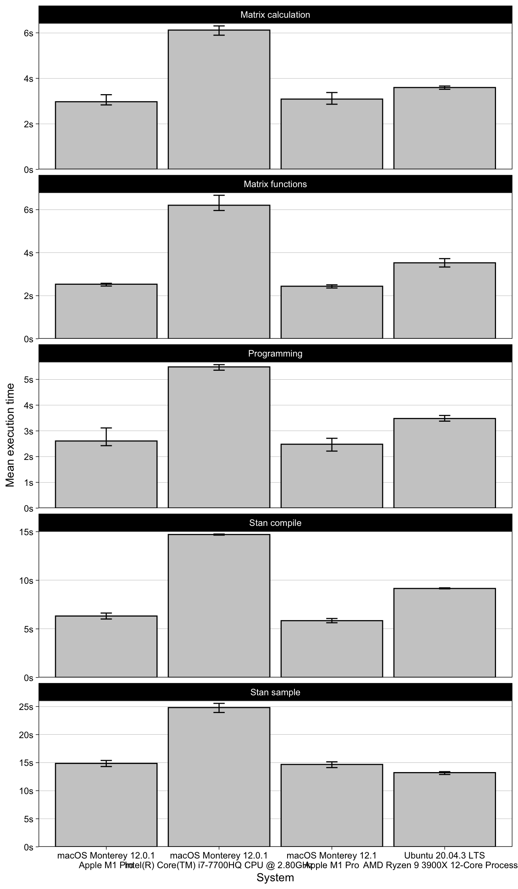

Results
================
Matti
26/11/2021

``` r
d %>% 
  ggplot(aes(mean, paste(cpu, os, sep = "\n"))) +
  scale_x_continuous("Mean execution time", expand = expansion(c(0, .1))) +
  geom_col() +
  facet_wrap("expr", nrow = 3) +
  theme(axis.title.y = element_blank())
```


